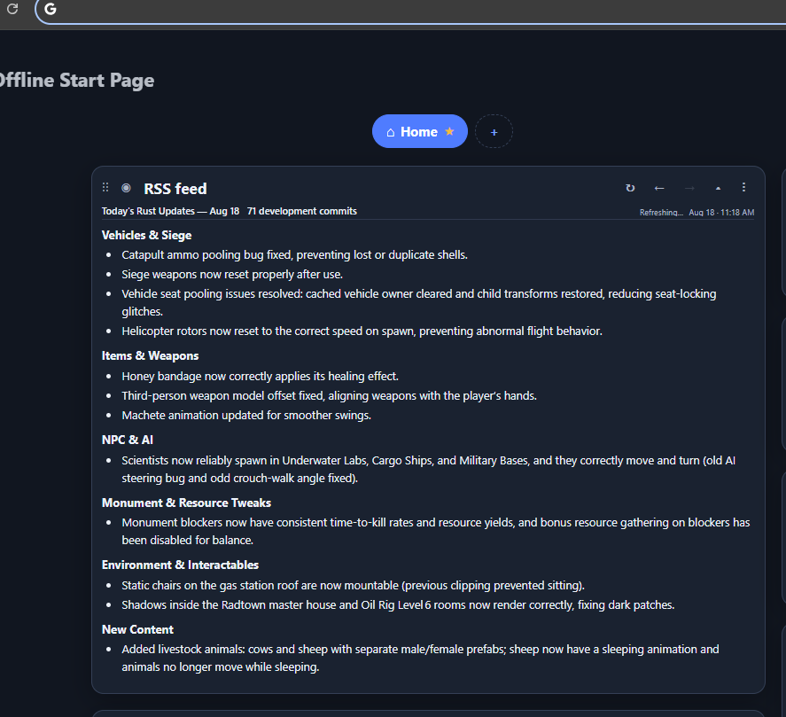

# Rust Development RSS Feed

A player-focused RSS feed that turns recent **Rust development commits** into short, readable daily summaries.

Instead of showing every technical commit, the feed focuses on changes that are actually interesting to Rust players — gameplay changes, bug fixes, weapons and equipment, NPCs and animals, monuments, vehicles, and other meaningful updates.

## RSS Feed

**Feed URL:**

`https://aslabsalbeh.github.io/rust-dev-feed/feed.xml`

The feed contains summaries for the latest few days of Rust development activity and can be used with standard RSS readers.

## Offline Start Page

This feed was built to work especially well with the custom **RSS widget** included in the **Offline Start Page** Chrome extension.

The widget provides:

- Player-focused daily Rust development summaries
- Compact and expanded views
- Topic-based sections
- Previous/next day navigation
- Automatic feed updates
- Clean rendering of headings and bullet points

**Offline Start Page:**  
https://chromewebstore.google.com/detail/offline-start-page-privat/eddedpnjieoihlkjgpheaffcpmbpmhap

The extension only reads the already-generated RSS feed, so additional users do not generate additional AI requests.

### RSS Widget Preview with widget width set to [Auto]

## How It Works

Every few hours, GitHub Actions automatically:

1. Fetches recent Rust development commits.
2. Groups them into daily updates.
3. Filters out developer-focused and low-value technical changes.
4. Prioritizes gameplay changes, bugs, content, NPCs, weapons, vehicles, monuments, and other player-relevant information.
5. Uses AI to turn the relevant commits into a concise daily digest.
6. Publishes the updated RSS feed through GitHub Pages.

Summaries are cached, so unchanged commits are not repeatedly sent to the AI.

## Example

Instead of highlighting technical commits such as:

> Increased icon-font atlas size and switched to on-demand glyph generation.

The feed prioritizes information such as:

> Fixed scientists not spawning in Underwater Labs, Cargo Ship, and military bases.

The goal is to answer one question:

**What happened in Rust development today that a player would actually want to know?**

## AI Summarization

Daily summaries are generated using **Groq**, with **OpenRouter** available as a fallback.

A player-relevance filter is applied before summarization to reduce development noise and prioritize useful changes.

## Disclaimer

This is an independent community project and is not affiliated with or endorsed by Facepunch Studios.

Rust and related trademarks belong to their respective owners. Development information summarized by this project is based on publicly available Rust development commits.
